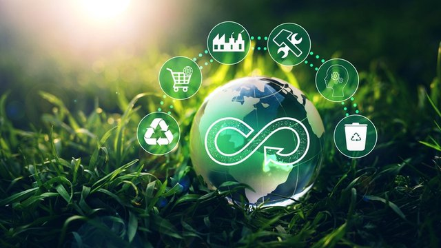

# 🔄 La Economía Circular

_Un trabajo sobre la Economía Circular_

---

## 📑 Índice

### 1. [Introducción](introduccion.md)
### 2. [Concepto de Economía Circular](concepto.md)
### 3. [Modelos de Producción Actuales y Consumismo](modelos.md)
### 4. [La Economía Verde](verde.md)
### 5. [Ciclo de Vida de un Producto](ciclo.md)
### 6. [El Ecodiseño y las Estrategias Sostenibles](ecodiseño.md)

---

## 💡 Conclusiones [Ver](conclusiones.md)

## 🧷 Mapa conceptual [Ver](mapa_conceptual.md)

## 📖 Glosario [Ver](glosario.md)

## 📚 Referencias [Ver](referencias.md)

## ✍️ Autores [Ver](autores.md)
