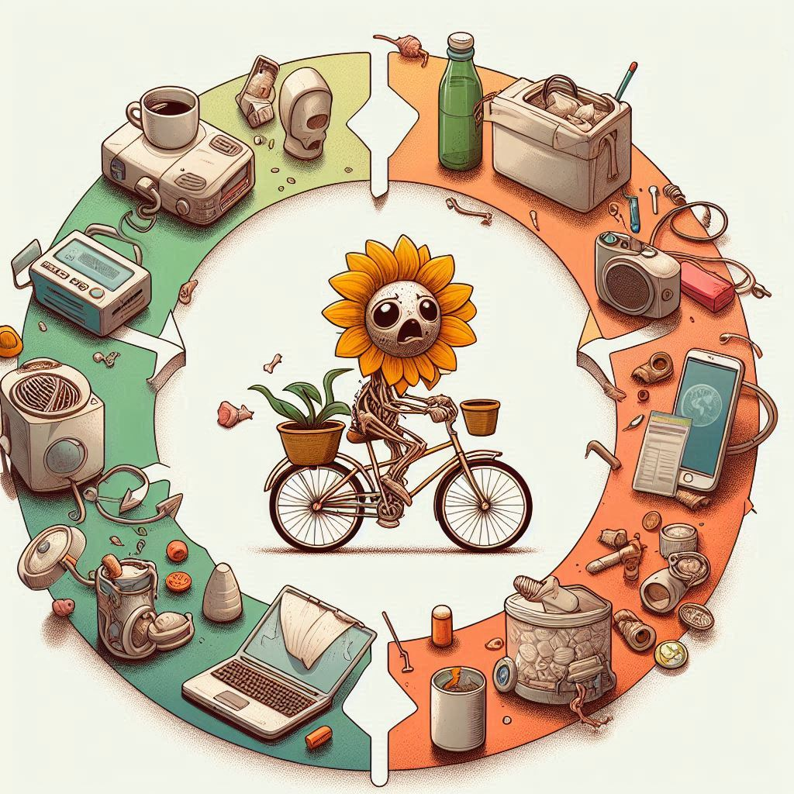

## ♻️ Ciclo de Vida de un Producto

El **Análisis del Ciclo de Vida** (ACV) mide el impacto ambiental de un producto desde su creación hasta su disposición final, promoviendo la economía circular a través del reciclaje y reutilización.

La *obsolescencia programada* está diseñada para limitar la vida útil de los productos, la cual fomenta el consumo insostenible y aumenta los residuos.

Este enfoque ayuda a identificar las etapas más críticas para mejorar la sostenibilidad en la producción y el consumo junto con la huella ecológica que es una medida que evalúa el impacto de las actividades humanas sobre los ecosistemas, cuantificando el uso de recursos naturales y la generación de residuos. 

El **ACV** es clave para evaluar la huella ecológica, guiar decisiones sostenibles y promover un consumo responsable. Las declaraciones ambientales proporcionan información valiosa para la sostenibilidad, la lucha contra el cambio climático y la toma de decisiones informadas.
