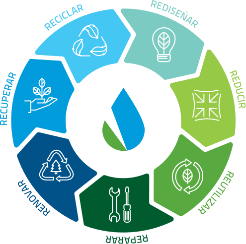

## 🔄 Concepto de Economía Circular

La *Economía Circular* es un modelo que se **centra en optimizar los recursos existentes para que puedan utilizarse el mayor tiempo posible en el proceso productivo**. 
El objetivo es minimizar la generación de residuos y aprovechar los residuos no reciclables.

Para ello, se basa en la **Regla de las 7R**:
Las siete "R" simbolizan: Redistribuir, Reducir, Reutilizar, Reparar, Regenerar, Recuperar y Rescatar. 

Colaborativamente, establecen un programa más integrador para proteger el medio ambiente y, al mismo tiempo, abogar por un ciclo económico regenerativo.
