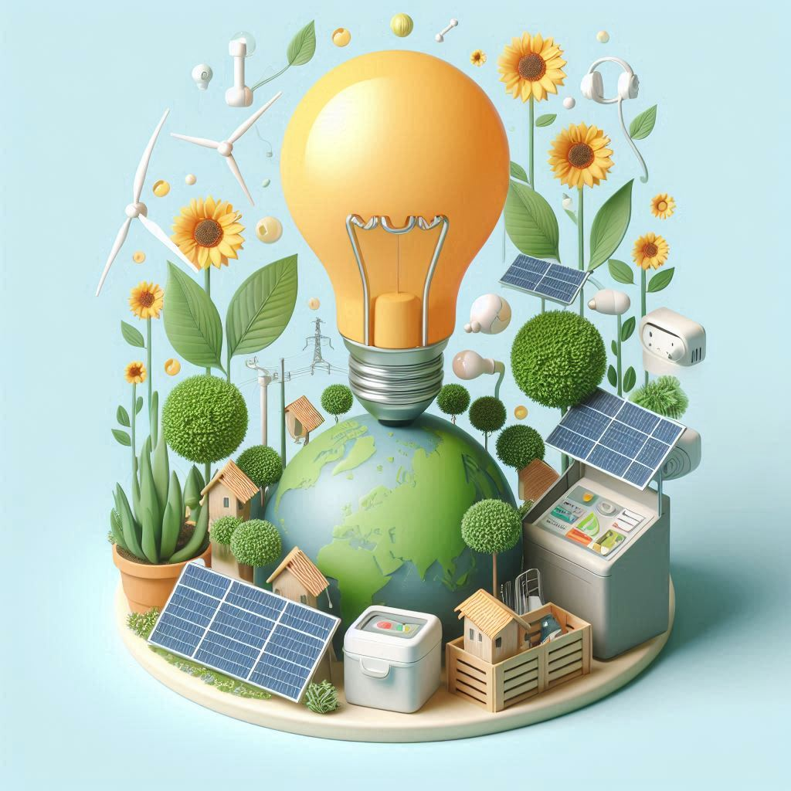

## 🌿 El Ecodiseño y las Estrategias Sostenibles

El **Ecodiseño y las Estrategias Sostenibles** son esenciales en la creación de productos y servicios que respeten el medio ambiente. El ecodiseño se enfoca en reducir el impacto ambiental de los productos a lo largo de todo su ciclo de vida, desde su concepción hasta su desecho, incorporando criterios ambientales en cada fase del diseño. Esta práctica busca no solo minimizar el uso de recursos y la generación de residuos, sino también fomentar la reutilización y el reciclaje, contribuyendo a la economía circular.

Las *8* Estrategias del Ecodiseño:
1. Nuevo concepto
2. Uso de materiales de impacto reducido
3. Reducción de elementos
4. Optimización de la producción
5. Optimización de la distribución
6. Reducción del impacto en el uso
7. Optimización de la vida útil
8. Optimización del fin de la vida

Las estrategias sostenibles, como la *Ecoinnovación*, mejoran la eficiencia de los procesos productivos, optimizan el consumo de materiales y energía, y promueven la creación de productos más sostenibles. El ACV ayuda a medir estos impactos, permitiendo una toma de decisiones informada que favorezca la sostenibilidad. En este contexto, la adopción de prácticas de ecodiseño no solo ayuda a cumplir con regulaciones ambientales, sino que también ofrece ventajas competitivas, reduce costes operativos y mejora la relación con clientes y proveedores.

