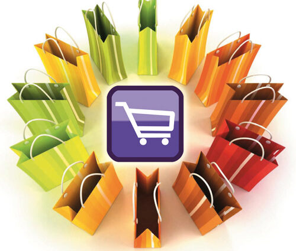

## 🏭 Modelos de Producción Actuales y Consumismo

La UE estipula que un Modelo de Producción implica la *distribución*, *financiación*, *reutilización*, *reparación*, *devolución* y *reciclaje* de productos. La vida útil de un producto, casi siempre puede ampliarse.

Los **Modelos de Producción** que tenemos en la actualidad sirven para reducir los costos según las necesidades, podemos diferenciar:
- *Artesanal*: Se realizan trabajos manualmente dónde la calidad es mayor y es personalizable. EJ: cerámica.
- *En Masa*: Fabricación a gran escala usando maquinaria con una alta eficiencia. EJ: vehículos.
- *Por Lotes*: Es el modelo intermedio entre lo artesanal y en masa. EJ: panaderías.
- *Continua*: Es la producción con procesos ininterrumpidos. No existen los tiempos muertos. EJ: petróleo.
- *Sostenible*: Utilizan materiales y energñias de manera responsable. Tienen un menor impacto medioambiental y una mejor reputación corporativa. EJ: productos reciclados.
- *Digital*: La conocida Industria 4.0. Utilizan inteligencia artifical, impresión 3D, etc. para lograr una mayor precisión, flexibilidad y personalización. EJ: la empresa Siemens.

El **Consumismo** es el acto de adquirir o acumular bienes y servicios que no siempre son necesarios. 

  

En la sociedad moderna, las compras masivas están agotando los recursos naturales y la economía se está volviendo cada vez más **inestable**. Algunas de las alternativas a las cuestiones comerciales son el desarrollo sostenible, el medio ambiente, la pobreza y el consumismo. La publicidad puede aumentar la satisfacción personal y la felicidad que las personas crean a través de las compras.
