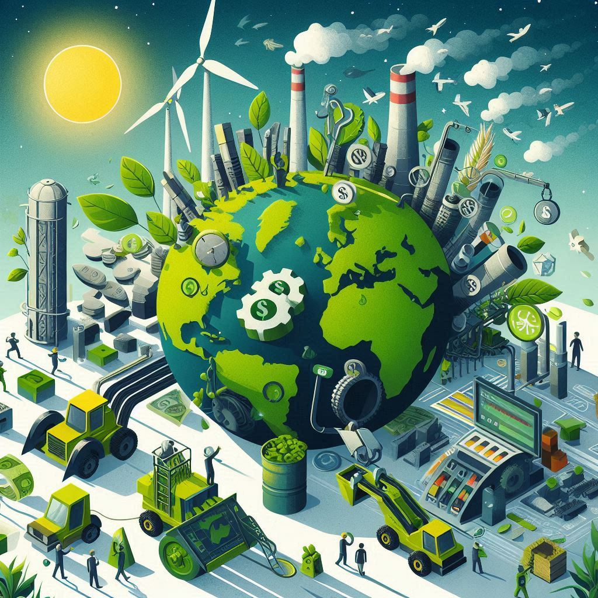

## 💵 La Economía Verde

La **Economía Verde** busca un desarrollo sostenible mediante el uso responsable de los recursos, minimizando el impacto ambiental y fomentando la justicia social y climática, especialmente para las comunidades vulnerables.

Con el **Pacto Verde Europeo de 2019**, la UE busca ser "climáticamente neutra" para 2050, impulsando industrias sostenibles y asegurando una transición justa. Este modelo conserva recursos para futuras generaciones y adapta las economías al cambio climático. 

Sus objetivos principales incluyen:
1. *Sostenibilidad Ambiental*: Conservación de ecosistemas, reducción de contaminación y uso de energías renovables.
2. *Desarrollo Inclusivo*: Creación de empleos verdes y apoyo a comunidades marginadas.
3. *Eficiencia de Recursos*: Optimización del consumo de materiales y energía.
4. *Responsabilidad Social*: Garantizar equidad, inclusión y condiciones laborales justas.
5. *Resiliencia Climática*: Adaptación a los desafíos del cambio climático.
